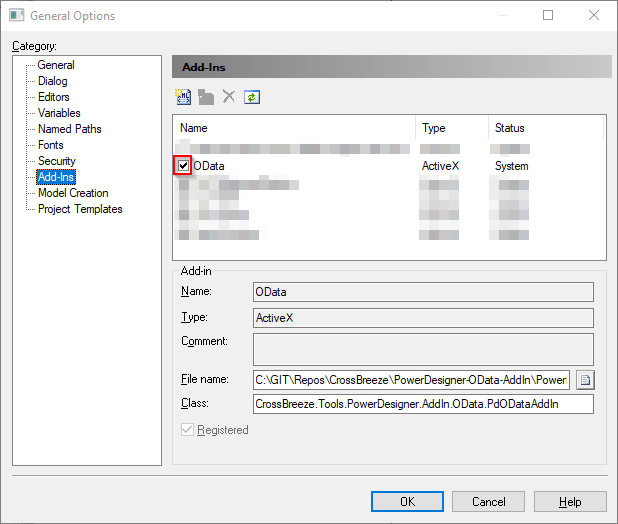
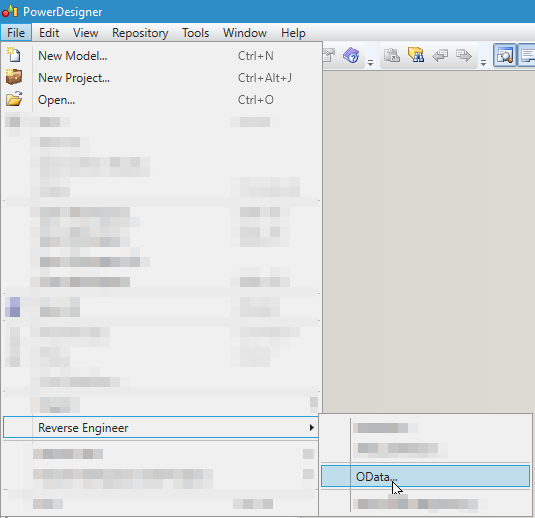
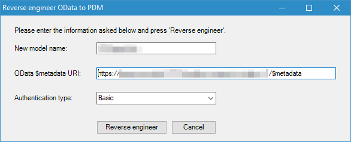
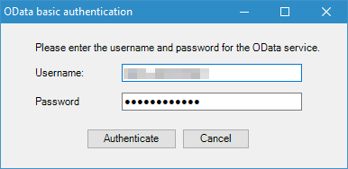
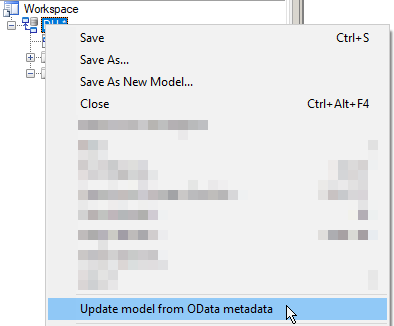
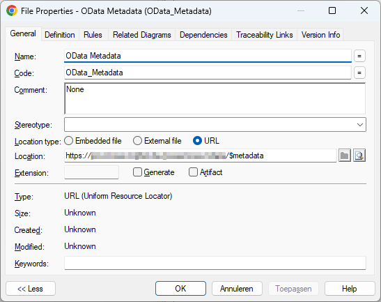

# PowerDesigner-OData-AddIn
An AddIn for PowerDesigner to synchronize OData metadata with a PDM model

## Installation
In order to use the plugin, execute the MSI installer which can be downloaded as a build artifact on the latest stable [main build](https://github.com/CrossBreezeNL/PowerDesigner-OData-AddIn/actions/workflows/main.yml).

Make sure to restart PowerDesigner after the installation. Then open Tools -> General Options -> Add-Ins and enable the 'OData' Add-In (by ticking the tick box before it).

## Usage
In the following sections the usage of the Add In is explained.
### Reverse engineer OData
In order to reverse engineer an OData service follow the following steps:
1. In the main menu of PowerDesigner click on `File` > `Reverse Engineer` > `OData...`.
   
1. A model dialog will popup to ask for the new model name, the metadata URI and the authentication type. The new model name will be the name of the new Physical Data Model containing the structure of the OData service.
  
1. If you have selected an authentication type other then `None` another model dialog will popup where you can pass the username and password.
  

After the previous steps are completed a new PDM model will be created in the active workspace and will be populated with tables (with columns) based on the metadata of the OData service.

Next to the tables there will also be a file named 'OData Metadata', which is a reference to the OData Metadata URI used to generate the PDM.

> **Note**
> The authentication information is not stored in the model. The authentication information will be asked for every time you update the model.

### Updating existing reverse engineered OData model
For any physical data model which contains a file with the code 'ODATA_METADATA' the menu option `Update model from OData metadata` will be available.

By clicking this menu option a new model will be generated using the OData metadata URI and a model merge window will popup which shows the difference between the existing OData physical data model and the metadata retrieved from the OData service.

If the authentication type is not `None`, a dialog will popup where the authentication information is requested during the update process.

### Manually adding OData Metadata file
When you want to update an existing model which was not reverse engineered using the Reverse Engineer menu option, you can manually add the OData Metadata file. Follow the steps below to do so:
1. Right-click on the model, choose `New` > `File`.
1. Given the new file the `Name` 'OData Metadata' and the `Code` 'ODATA_METADATA'.
1. Set the `Location type` to 'URL'.
1. Set the `Location` to the URL to the $metadata location of the OData metadata service.
1. Set the `Comment` value either to 'None' or 'Basic', depending on the required authentication method.
1. Untick the `Generate` option.
1. Click `OK`.

Once you have completed the above steps the update menu opion will be available as explained in [Updating existing reverse engineered OData model](#updating-existing-reverse-engineered-odata-model).

## Debugging
To debug the plugin:

- Open the [solution](./PowerDesigner_OData_AddIn.sln) in Visual Studio which is running as Administator (so it can register new DLLs)
- Build the project in Debug (this will also register the Add-In in the Windows Registry for PowerDesigner).

Now you can enable the Add-In in PowerDesigner in Tools -> General Options -> Add-Ins. The name of the Add-In is 'OData'. If the OData add-in is disabled in PowerDesigner (checkbox is grayed out) it might be needed to run PowerDesigner as Administrator.

## Resources

### PowerDesigner
- Modeling with PowerDesigner
  - [Customizing Your Modeling Environment > General Options > Add-Ins](https://help.sap.com/docs/SAP_POWERDESIGNER/abd3434b4987485c92057ab9392aadbe/c7e194046e1b101492b38124129e7841.html?locale=en-US&version=16.6.10)
- Customizing and Extending PowerDesigner
  - [Creating an ActiveX Add-in](https://help.sap.com/docs/SAP_POWERDESIGNER/31c48596e34446a68956e0aa7e700a2e/c7d62f7d6e1b1014b6b5cd497c583efb.html?locale=en-US&version=16.6.10)
  - [The PowerDesigner Public Metamodel](https://help.sap.com/docs/SAP_POWERDESIGNER/31c48596e34446a68956e0aa7e700a2e/c7d0294d6e1b1014b766cb40bbc4f211.html?version=16.7.02&locale=en-US)

### OData
- [Microsoft OData documentation](https://learn.microsoft.com/nl-nl/odata/)
- OData Examples
  - https://pragmatiqa.com/xodata/odatadir.html